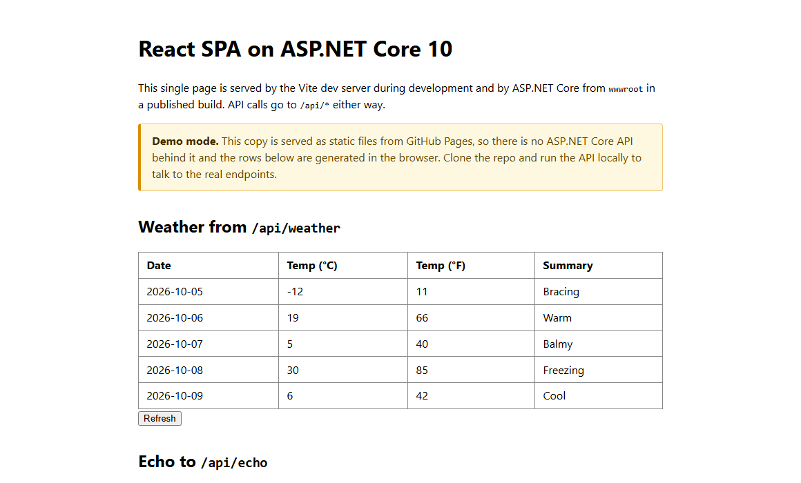

# React SPA hosted by an ASP.NET Core 10 API

A single-repository single-page application: a **Vite + React + TypeScript**
front end backed by an **ASP.NET Core 10 minimal API**. During development the
Vite dev server proxies `/api` calls to the API; a published build compiles the
React app into the API's `wwwroot` so one web host serves everything.

| Project | What it is |
| --- | --- |
| `ReactSpa.Api/` | ASP.NET Core 10 minimal API (`/api/weather`, `/api/echo`) that serves the SPA from `wwwroot` when built |
| `ClientApp/` | Vite + React + TypeScript SPA |

## Live demo (GitHub Pages)

**[Open the deployed demo](https://bobhuang1.github.io/DotNetCode/)**



The same SPA is published to GitHub Pages by `.github/workflows/pages.yml`.
Because Pages can only host static files, there is no ASP.NET Core API behind
that copy, so it runs in **demo mode**: `/api/*` is unreachable, and the app
falls back to a forecast generated in the browser plus a local echo, and shows
a banner saying so.

The fallback is deliberately narrow. Only a *missing* API (network error, or
404/405 from the static host) triggers it; a real API failure such as a 500
still surfaces as an error, so a genuine server bug is never masked.

Two settings make the difference between the two hosts:

- `VITE_BASE_PATH` sets the Vite `base`. The Pages workflow builds with
  `VITE_BASE_PATH=/DotNetCode/`; the default `/` is what the ASP.NET Core host
  needs when it serves the build from its own `wwwroot` root. API calls are
  resolved through `import.meta.env.BASE_URL`, so they follow the same prefix.
- Run the app locally (below) to exercise the real endpoints.

## Run it (development)

```powershell
# 1. Start the API (http://localhost:5080)
dotnet run --project ReactSpa.Api

# 2. In another terminal, start the Vite dev server (http://localhost:5173)
cd ClientApp
npm install
npm run dev
```

Open http://localhost:5173. `/api/*` calls are proxied to the API. No npm
install is needed to run the raw API; the SPA is a completely separate dev
server until published.

## Run it (single host / production shape)

The csproj has two MSBuild hooks:

- **Build** copies `ClientApp/dist` into `ReactSpa.Api/wwwroot` if the dist
  folder exists (run `npm run build` once first). Then
  `dotnet run --project ReactSpa.Api` serves the SPA at http://localhost:5080
  with `MapFallbackToFile("index.html")` for client-side routing.
- **Publish** runs `npm install` + `npm run build` itself and includes the
  result in the publish output.

```powershell
cd ReactSpa
$env:VITE_API_PROXY_TARGET = "http://localhost:5080"
cd ClientApp; npm install; npm run build; cd ..
dotnet run --project ReactSpa.Api        # serves the built SPA
# or
dotnet publish ReactSpa.Api -c Release   # rebuilds the SPA and bundles it
```

## What it demonstrates

- .NET 10 minimal API with typed endpoints and C# records as JSON contracts.
- Vite dev-server proxy so a single origin (`/api`) works in both dev and prod.
- `CopySpaToWwwRoot` + `PublishClientApp` MSBuild targets in
  `ReactSpa.Api/ReactSpa.Api.csproj` — the standard "one repo, one deployable"
  pattern.
- React 19 function components, `tsc` type checking in the `build` script,
  and no client-side routing to keep the sample small (add `react-router` for
  real routing; the fallback file already accounts for it).

## Notes

- The proxy target defaults to `http://localhost:5080`; override with the
  `VITE_API_PROXY_TARGET` env var.
- The API listens on HTTP (`http://localhost:5080`) to avoid dev-cert setup;
  enable HTTPS + `UseHttpsRedirection` for anything real.
- `wwwroot`, `node_modules`, `dist`, `bin`, and `obj` are gitignored — the SPA
  is a build artifact.